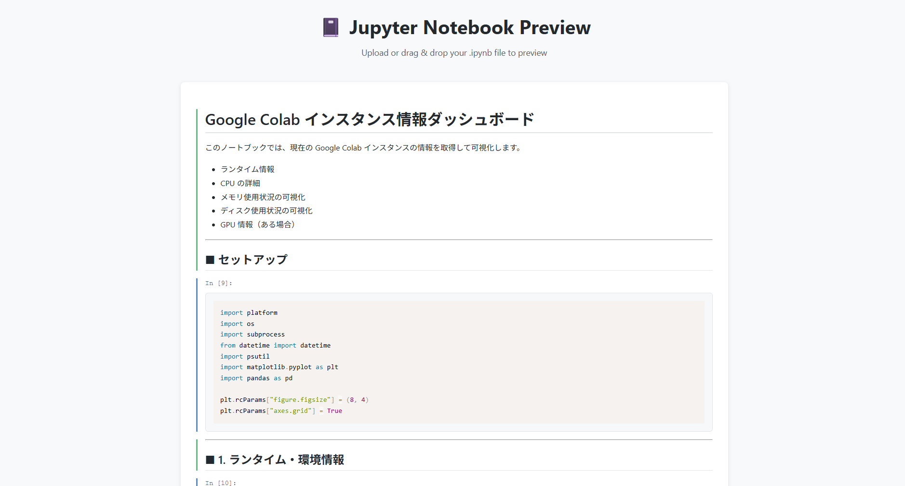

# 📓 Jupyter Notebook Preview

A lightweight, client-side web application for previewing Jupyter Notebook (.ipynb) files directly in your browser. No server required!

## Features

- ✨ **Client-side rendering** - All processing happens in your browser
- 📤 **Drag & Drop** - Easy file upload interface
- 🎨 **Syntax highlighting** - Beautiful code rendering with Prism.js
- 📊 **Rich output support** - Displays text, HTML, images (PNG, JPEG, SVG), and more
- 🎯 **Markdown rendering** - Full GitHub Flavored Markdown support
- 🚀 **GitHub Pages ready** - Deploy as a static site
- 📱 **Responsive design** - Works on desktop and mobile devices

## Demo



🔗 **[Live Demo](https://sunwood-ai-labs.github.io/jupyter-preview/)**

Try the sample notebook: [examples/sample.ipynb](examples/sample.ipynb)

## Usage

### Online

1. Visit the [live demo](https://sunwood-ai-labs.github.io/jupyter-preview/)
2. Drag and drop your `.ipynb` file or click to browse
3. Your notebook will be rendered instantly!

### Local Development

1. Clone this repository:
```bash
git clone https://github.com/Sunwood-ai-labs/jupyter-preview.git
cd jupyter-preview
```

2. Open `index.html` in your browser or serve with a local web server:
```bash
# Using Python
python -m http.server 8000

# Using Node.js
npx http-server

# Or any other static file server
```

3. Navigate to `http://localhost:8000`

### Load from URL

You can also load notebooks directly from a URL:

```
https://sunwood-ai-labs.github.io/jupyter-preview/?url=https://raw.githubusercontent.com/your-repo/notebook.ipynb
```

## Supported Features

### Cell Types
- ✅ Code cells with syntax highlighting
- ✅ Markdown cells with full formatting
- ✅ Raw cells

### Output Types
- ✅ Text output (stdout/stderr)
- ✅ Execution results
- ✅ Display data
- ✅ Error tracebacks with ANSI color support
- ✅ HTML output
- ✅ Images (PNG, JPEG, SVG)
- ✅ JSON data

### Markdown Features
- ✅ Headers (H1-H6)
- ✅ Bold, italic, strikethrough
- ✅ Code blocks with syntax highlighting
- ✅ Inline code
- ✅ Lists (ordered and unordered)
- ✅ Tables
- ✅ Blockquotes
- ✅ Links and images

## Technology Stack

- **HTML5** - Structure
- **CSS3** - Styling with custom properties and animations
- **Vanilla JavaScript** - No framework dependencies
- **Marked.js** - Markdown parsing
- **Prism.js** - Syntax highlighting
- **Ansi Up** - ANSI escape code conversion

## Project Structure

```
jupyter-preview/
├── index.html          # Main HTML file
├── styles.css          # Stylesheet
├── app.js             # Application logic
├── examples/          # Sample notebooks
│   └── sample.ipynb   # Demo notebook
├── .nojekyll          # GitHub Pages configuration
└── README.md          # This file
```

## GitHub Pages Deployment

This project is configured for GitHub Pages deployment:

1. Push your changes to the repository
2. Go to repository Settings → Pages
3. Select "Deploy from a branch"
4. Choose the branch (e.g., `main` or `gh-pages`)
5. Select the root folder (`/`)
6. Click Save

Your site will be available at: `https://[username].github.io/jupyter-preview/`

## Browser Support

- ✅ Chrome/Edge (latest)
- ✅ Firefox (latest)
- ✅ Safari (latest)
- ✅ Mobile browsers

## Limitations

- No code execution - This is a viewer only
- Some complex outputs may not render perfectly
- Interactive widgets are not supported
- Large files may take time to process

## Contributing

Contributions are welcome! Please feel free to submit a Pull Request.

1. Fork the repository
2. Create your feature branch (`git checkout -b feature/amazing-feature`)
3. Commit your changes (`git commit -m 'Add some amazing feature'`)
4. Push to the branch (`git push origin feature/amazing-feature`)
5. Open a Pull Request

## License

This project is open source and available under the [MIT License](LICENSE).

## Acknowledgments

- [Jupyter Project](https://jupyter.org/) for the amazing notebook format
- [Marked.js](https://marked.js.org/) for Markdown parsing
- [Prism.js](https://prismjs.com/) for syntax highlighting
- [Ansi Up](https://github.com/drudru/ansi_up) for ANSI color support

## Support

If you find this project helpful, please consider giving it a star on GitHub!

---

Made with ❤️ by [Sunwood AI Labs](https://github.com/Sunwood-ai-labs)
